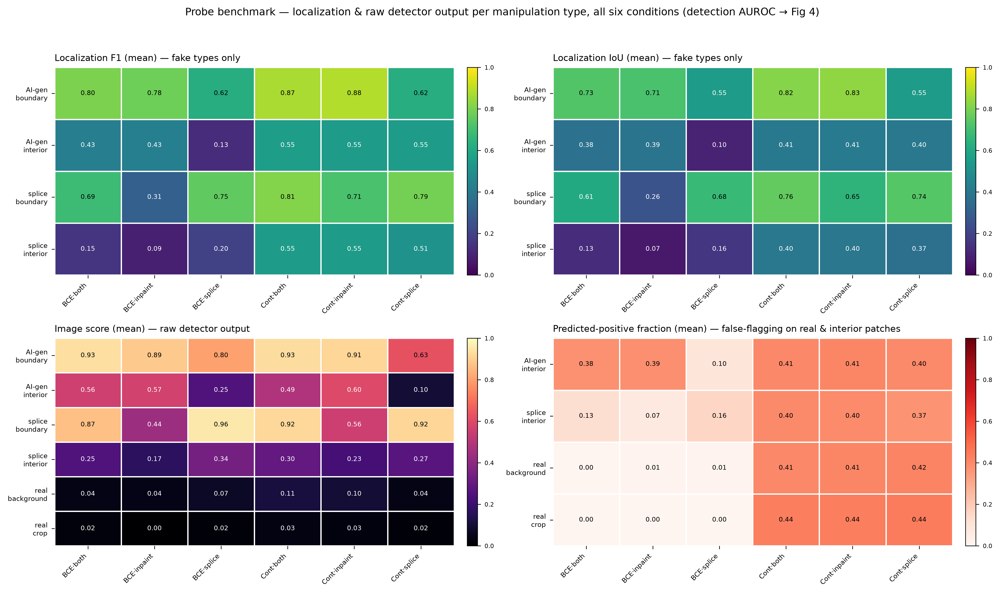
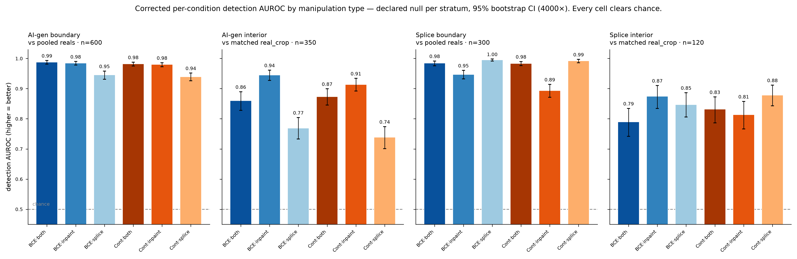
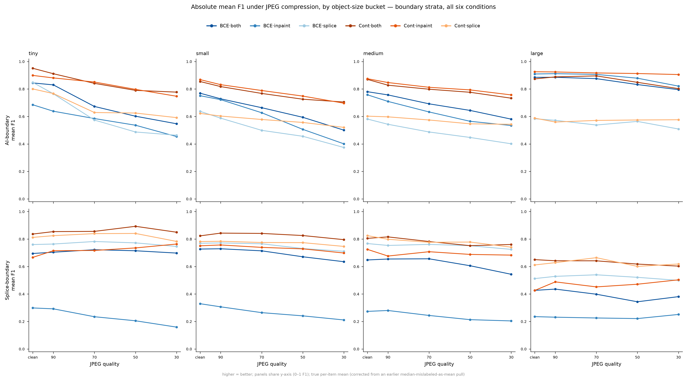
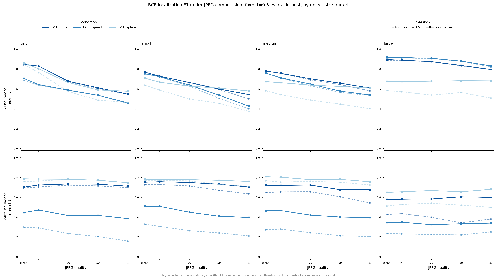

# BCE Emergence — Results Report

*DINO_SCOPE_July · `results/bce_emergence` · six conditions (BCE / contrastive objective × both / inpaint / splice training data), seed 0. All measures reported as **mean** unless a distribution is shown. Detection reported as AUROC under corrected, declared nulls with 95% bootstrap CIs (§5).*

---

## TL;DR

- **Image-level detection is the headline.** On full synthetic images, inpaint-trained models lead (AUC 0.94 BCE / 0.92 contrastive); splice-only training does **not** transfer to full fakes (0.44 / 0.49, at or below chance); "both" sits between (0.87 / 0.86).
- **On the probe benchmark, detection is AUROC — never mean image score.** The mean is not comparable across the BCE↔contrastive boundary (per-condition reals baselines differ 2–3×) and is confounded by the decoder (BCE threshold vs contrastive k-means). §5 gives the one corrected detection table.
- **Under corrected, declared nulls, every condition × type cell clears chance** (lowest CI lower-bound 0.70). Boundaries are detected near-perfectly (0.89–1.00); interiors are harder and objective-dependent (0.74–0.94).
- **The one place signal vanishes: splice interiors against the size-matched train-negative distribution.** Equalizing window size collapses BCE·splice from 0.62 to 0.53 [0.48,0.58] (CI includes chance) and Cont·splice from 0.66 to 0.59 [0.55,0.64] — the interior "signal" against the training negatives is largely size-driven, not a detectable edit (see §5.1).
- **For localization, judge boundary crops only** (interiors are all-fake → degenerate precision; full-fakes localization is a k-means byproduct). On boundaries, **contrastive leads at every regime** (§4).
- **Splice interiors are genuinely near-identical to reals** (§6): the elevated mean is a positive-outlier tail; the bulk sits a hairline above reals.
- **Under JPEG compression (§7), BCE's edit-specific interior channel is the single most durable signal in the study** — it beats contrastive at every compression level on the matched inpaint mix, while BCE's own background/texture channel is the one signal that inverts below chance under heavy compression (0.418 AUROC at q30). The earlier "contrastive's interior lead is mostly texture" reading does not survive matched-mix pairing and is retired.
- **Threshold recalibration (§8) explains most, but not all, of BCE's localization decay under compression.** Two of three BCE conditions stay well-calibrated at every quality level (gap ≤0.014); BCE·splice's ai_boundary miscalibration gap widens sharply under compression (0.075→0.193), while BCE·inpaint's sp_boundary gap (~0.17–0.19) is a flat cross-domain deficit, not compression-driven.

---

## 1 · Full-fakes: image detection and (byproduct) localization

Image-detection AUC, localization F1/IoU (mean), and real-image accuracy across the six conditions, with 95% bootstrap CIs.

| condition | image AUC | F1 (mean) | IoU (mean) | reals acc |
|---|---|---|---|---|
| BCE·both | 0.875 | 0.344 | 0.285 | 0.990 |
| BCE·inpaint | **0.944** | 0.510 | 0.440 | 0.992 |
| BCE·splice | 0.437 | 0.040 | 0.027 | 0.973 |
| Cont·both | 0.855 | 0.565 | 0.412 | 0.551 |
| Cont·inpaint | 0.917 | 0.576 | 0.426 | 0.549 |
| Cont·splice | 0.493 | 0.570 | 0.417 | 0.599 |

**Read:** inpaint training gives the best full-fake detector under either objective; splice-only training collapses to chance on full fakes. The BCE/contrastive gap on image AUC is small (≤0.03) at every training regime. **Localization F1/IoU on full fakes is a byproduct of spherical k-means (k=2) and is not a meaningful result** — note contrastive's flat ~0.57 F1 regardless of training data, and the reals-accuracy split (BCE ~0.99 vs contrastive ~0.55) that reflects the decoders' different "off" behaviour, not detection quality.

---

## 2 · Probe benchmark by manipulation type

Per-type localization (F1, IoU) and raw detector output (image score, predicted-positive fraction), all six conditions. **Detection AUROC is deliberately not shown here** — it lives in §5 with the corrected nulls, because the raw image score above is *not* a safe detection comparison across conditions (see §5). This panel is for localization behaviour and for seeing the decoders' false-flagging: contrastive's k-means flags ~40% of patches even on genuine real crops (no "off" state), while BCE sits near 0.00.

---

## 3 · Generator difficulty (full-fakes)

Per-generator detection AUROC, 27 generators × 6 conditions, sorted hardest→easiest. Hardest: flux-mvc5000, flux-1.1-pro, ideogram-3.0, imagen-3.0-002. Easiest: sd-2.1, sd-1.5, sdxl, sd-1.5-dreamshaper. The splice-trained columns are uniformly poor, consistent with §1.

---

## 4 · Localization: BCE vs contrastive — boundary crops only

**Interiors are the wrong stratum** for localization: they are all-fake, so contrastive precision is pinned at exactly 1.000 on 100% of crops and interior F1 reflects the k-means decoder, not representation quality. Boundary crops contain both real and fake patches — a genuine localization objective. On boundaries, **contrastive leads at every regime**:

| | BCE F1 | Cont F1 | Δ | BCE IoU | Cont IoU | Δ |
|---|---|---|---|---|---|---|
| both | 0.745 | 0.842 | +0.098 | 0.667 | 0.790 | +0.123 |
| inpaint | 0.542 | 0.798 | +0.256 | 0.485 | 0.742 | +0.257 |
| splice | 0.689 | 0.706 | +0.017 | 0.613 | 0.642 | +0.030 |

BCE·inpaint collapses on splice boundaries (sp_boundary F1 0.306) from training-data mismatch; contrastive holds up (0.712). This is the strongest single argument for the contrastive objective on the localization head.

---

## 5 · Corrected detection AUROC — the one detection table

This section replaces every earlier AUROC view. It reports detection as rank-AUROC (Mann–Whitney) under a **declared, corrected null per stratum**, with 4000× bootstrap 95% CIs.

**The corrections, and why:**

1. **AUROC, not mean image score.** Mean measures absolute activation magnitude; it is not comparable across the BCE↔contrastive boundary because each condition's reals baseline differs (contrastive reals sit 2–3× higher than BCE reals). A contrastive fake at mean 0.90 is separated from reals at ~0.07; a BCE fake at the same 0.90 clears a lower bar (~0.02). Only rank-AUROC against a matched reference is comparable across conditions.
2. **Declare the null per stratum.** Interiors are scored against the **matched `real_crop`** — the identical interior window re-derived on the pristine original with the same deterministic RNG as the paired fake (matched geometry, max |Δarea_frac| = 0 over 300 tgif pairs). Boundaries are scored against **pooled reals** (boundary AUROC is reference-independent — moves <0.06 regardless of reference). We never silently pool the `fr_bg` "real background" into an interior comparison: `fr_bg` drifts fake-ward (it is an outside-mask window on the *modified* image) and depresses interior AUROC.

**Corrected detection AUROC (point [95% CI]):**

| type | BCE·both | BCE·inpaint | BCE·splice | Cont·both | Cont·inpaint | Cont·splice |
|---|---|---|---|---|---|---|
| AI-gen boundary (n=600) | 0.99 [0.98,0.99] | 0.98 [0.98,0.99] | 0.95 [0.93,0.96] | 0.98 [0.98,0.99] | 0.98 [0.97,0.99] | 0.94 [0.93,0.95] |
| AI-gen interior (n=350) | 0.86 [0.83,0.89] | 0.94 [0.93,0.96] | 0.77 [0.73,0.80] | 0.87 [0.85,0.90] | 0.91 [0.89,0.93] | 0.74 [0.70,0.77] |
| splice boundary (n=300) | 0.98 [0.98,0.99] | 0.95 [0.93,0.96] | 1.00 [0.99,1.00] | 0.98 [0.98,0.99] | 0.89 [0.87,0.91] | 0.99 [0.99,1.00] |
| splice interior (n=120) | 0.79 [0.74,0.83] | 0.87 [0.83,0.91] | 0.85 [0.81,0.89] | 0.83 [0.79,0.87] | 0.81 [0.77,0.86] | 0.88 [0.84,0.91] |

**Every cell clears chance** — the lowest CI lower-bound across all 24 cells is 0.70. Boundaries are detected near-perfectly everywhere; interiors are harder and objective-dependent (best: BCE·inpaint ai_interior 0.94; worst: Cont·splice ai_interior 0.74).

### 5.1 · The size caveat — ai_interior vs size-corrected tgif reals

The §5 table scores interiors against the matched pristine crop. But there are three legitimate real references for `ai_interior`, and they answer different questions. Restricting to the **tgif-only subset (n=300)** so the comparison is strictly tgif↔tgif, and scoring the *same* ai_interior fakes against each:

| condition | vs matched `real_crop` (same crop, edit-only) | vs `fr_bg` raw (unmatched, ~126 px) | vs `fr_bg` size-matched (full-dist reweight) |
|---|---|---|---|
| BCE·both | 0.84 [0.80,0.87] | 0.80 | 0.80 [0.76,0.84] |
| BCE·inpaint | 0.94 [0.92,0.96] | 0.88 | 0.88 [0.85,0.91] |
| **BCE·splice** | 0.76 [0.72,0.80] | 0.62 | 0.53 [0.48,0.58] * |
| Cont·both | 0.86 [0.83,0.89] | 0.71 | 0.70 [0.66,0.74] |
| Cont·inpaint | 0.90 [0.88,0.92] | 0.76 | 0.75 [0.71,0.79] |
| **Cont·splice** | 0.72 [0.68,0.76] | 0.66 | 0.59 [0.55,0.64] |

*All AUROC point [95% CI], 4000× two-sided bootstrap. `*` = CI includes 0.5 (not distinguishable from chance). `real_crop` and size-matched `fr_bg` restricted to tgif2 parents (n=300); size-match is a full-histogram reweight of `fr_bg` onto the ai_interior window-size distribution (TV distance → 0.000), not a single-target match.*

**Why size-correct, and why it can only depress.** `fr_bg` windows are 1.31× larger than ai_interior (median 126 vs 96 px), and within `fr_bg` the image score *decreases* with window size (Spearman rho −0.06 to −0.44, negative in every condition — see Fig 10). So equalizing size removes an advantage the reals had, and the correction can only pull AUROC down, never inflate it.

**What the three columns show.** The matched `real_crop` is the strictest, most honest null (identical crop on the pristine original) and every condition clears it comfortably — the edit *is* detectable there. The size-matched `fr_bg` asks the harder train-distribution question, and it is where the two splice conditions fall apart: **BCE·splice drops 0.62 → 0.53 (CI includes chance)** and **Cont·splice 0.66 → 0.59 (marginal, p=0.0003)**, while the other four conditions barely move (raw ≈ size-matched). So the splice-interior "signal" against the training negatives was substantially size-driven; against the matched pristine crop it survives (0.76 / 0.72). This is the load-bearing caveat behind any interior claim.

---

## 6 · The splice-interior distribution

Per-image image-score distributions for splice interiors (n=120/condition), with the pooled-reals reference. **Bimodal** (verified against raw histograms, not a KDE artifact): a large low mode near reals and a small high tail. Missed (<0.2) / caught (>0.8) / middle fractions: BCE·both 72/21/7, BCE·inpaint 82/13/5, BCE·splice 61/26/13, Cont·both 64/22/13, Cont·inpaint 71/13/16, Cont·splice 69/18/12.

The elevated **mean** is carried by the high tail (heavier tampering); the **bulk of spliced interiors is near-indistinguishable from the real portions** — confirming there is no strong intrinsic "spliced-region signal." Even the low bin sits a hairline above reals (medians ~0.01–0.03 vs ~0.001–0.01, ~1.3–2.8×), enough to lift rank-AUROC without implying perceptible difference. The saliency/low-level-statistics mechanism behind that hairline shift is plausible but unconfirmed.

---

## 7 · Compression robustness (JPEG ladder, all six conditions)

*(fig12's by-bucket breakdown reports the true per-item **mean** F1 recomputed directly from `noise_probe` records; an earlier pull of this figure used the `robustness_summary.json` per-bucket fields, which are internally mislabeled — despite the `f1_tiny`/`f1_small`/`f1_medium`/`f1_large` key names, they hold the per-bucket **median**, not the mean. The condition-level `f1_mean` field used everywhere else in this report and in the tables below is unaffected — it is a true mean. fig12b adds the BCE-only oracle-best-threshold overlay per size bucket, requested to check whether recalibration changes the size-bucket picture: it does not change the ranking — BCE·inpaint's sp_boundary deficit and BCE·splice's ai_boundary miscalibration both persist at every bucket size under the oracle threshold, confirming §8's aggregate reading holds per-bucket too.)*

All six conditions were re-scored on the same 2,020-item probe set (unresampled — the same items re-encoded at each JPEG quality) at clean, q90, q70, q50, q30. Training-time JPEG augmentation was light-tier (q∈[88,98], p=0.25, identical across conditions), so q≤80 is out-of-distribution for every condition equally — comparisons *between* conditions at a given quality are clean; the *absolute* level of decay below q80 mixes genuine signal loss with generic distribution-shift fragility.

**Detection AUROC by JPEG quality — matched-null, absolute values:**

AI-interior vs matched real crop (tgif2, n=300/300):

| condition | clean | q90 | q70 | q50 | q30 |
|---|---|---|---|---|---|
| BCE·both | 0.839 | 0.825 | 0.776 | 0.731 | 0.673 |
| BCE·inpaint | 0.940 | 0.928 | 0.886 | 0.843 | 0.778 |
| BCE·splice | 0.758 | 0.700 | 0.678 | 0.643 | 0.567 |
| Cont·both | 0.862 | 0.858 | 0.800 | 0.745 | 0.691 |
| Cont·inpaint | 0.901 | 0.889 | 0.819 | 0.773 | 0.714 |
| Cont·splice | 0.719 | 0.682 | 0.653 | 0.606 | 0.626 |

Regen background vs matched real crop (tgif2, n=300/300) — the "texture fingerprint" channel:

| condition | clean | q90 | q70 | q50 | q30 |
|---|---|---|---|---|---|
| BCE·both | 0.635 | 0.584 | 0.507 | 0.486 | 0.468 |
| BCE·inpaint | 0.663 | 0.629 | 0.519 | 0.473 | **0.418** |
| BCE·splice | 0.780 | 0.718 | 0.682 | 0.610 | 0.494 |
| Cont·both | 0.808 | 0.813 | 0.718 | 0.675 | 0.633 |
| Cont·inpaint | 0.852 | 0.821 | 0.751 | 0.714 | 0.699 |
| Cont·splice | 0.606 | 0.596 | 0.554 | 0.540 | 0.523 |

AI-boundary and splice-boundary vs pooled reals (n=600/300 and n=300/300) stay near-ceiling throughout (0.85–0.99 across every cell) — boundary/seam evidence is the compression-robust channel in this study, for every condition.

**Three findings from the ladder:**

1. **BCE's edit-specific channel is the most durable signal in the whole study.** For the inpaint mix, BCE·inpaint's interior detection decays from 0.940 (clean) to 0.778 (q30) — still well above chance — while its own background/texture channel (fr_bg vs real_crop) **crosses below 0.5 at q30 (0.418)**: heavily-compressed regenerated background scores *more real* than a pristine real crop, a genuine inversion, not just decay to chance.
2. **The matched-mix comparison (same training data, BCE vs contrastive) reverses the naive cross-condition read.** Comparing BCE·inpaint to Cont·inpaint directly (paired bootstrap on the same held-out items) shows BCE **leading** interior detection at every compression level, and the gap **widens** under compression:

   | mix | clean | q90 | q70 | q50 | q30 |
   |---|---|---|---|---|---|
   | both | +0.023 | +0.034* | +0.025 | +0.014 | +0.018 |
   | inpaint | **-0.038*** | **-0.039*** | **-0.067*** | **-0.070*** | **-0.065*** |
   | splice | -0.039 | -0.018 | -0.026 | -0.036 | +0.059* |

   (Δ = Cont − BCE AUROC, matched-item paired bootstrap, 4000×; `*` = 95% CI excludes zero.) This retires the earlier reading (built on an unmatched, apples-to-oranges comparison) that contrastive's interior lead was "mostly regenerated texture" — under matched-mix pairing BCE·inpaint is significantly *ahead* of Cont·inpaint on interior detection at every quality level, and contrastive's own fr_bg/int channels move together rather than dissociating the way BCE's do (0.852/0.901 clean → 0.699/0.714 at q30 — the gap between them barely narrows), suggesting a less-factored representation rather than a texture-dominated one. The "both" mix stays a wash at every level; splice is mostly noise (small marginal Cont edge only at q30).
3. **Localization decay under a fixed decision threshold (t=0.5) is steep and confounds signal loss with calibration** (resolved in §8). Absolute mean F1, ai_boundary and sp_boundary:

   | condition | clean | q90 | q70 | q50 | q30 |
   |---|---|---|---|---|---|
   | BCE·both (ai_boundary) | 0.802 | 0.777 | 0.716 | 0.658 | 0.589 |
   | BCE·inpaint (ai_boundary) | 0.779 | 0.749 | 0.681 | 0.602 | 0.533 |
   | BCE·splice (ai_boundary) | 0.625 | 0.584 | 0.509 | 0.477 | 0.417 |
   | Cont·both (ai_boundary) | 0.871 | 0.842 | 0.809 | 0.772 | 0.740 |
   | Cont·inpaint (ai_boundary) | 0.884 | 0.859 | 0.827 | 0.800 | 0.762 |
   | Cont·splice (ai_boundary) | 0.623 | 0.606 | 0.580 | 0.562 | 0.545 |
   | BCE·both (sp_boundary) | 0.687 | 0.692 | 0.687 | 0.648 | 0.614 |
   | BCE·inpaint (sp_boundary) | 0.306 | 0.294 | 0.252 | 0.226 | 0.201 |
   | BCE·splice (sp_boundary) | 0.754 | 0.754 | 0.757 | 0.734 | 0.711 |
   | Cont·both (sp_boundary) | 0.813 | 0.829 | 0.820 | 0.812 | 0.789 |
   | Cont·inpaint (sp_boundary) | 0.712 | 0.716 | 0.713 | 0.708 | 0.698 |
   | Cont·splice (sp_boundary) | 0.790 | 0.788 | 0.783 | 0.780 | 0.746 |

   Contrastive leads ai_boundary localization at every quality (consistent with §4's clean-data finding). BCE·inpaint's near-zero sp_boundary F1 (0.306→0.201) is the previously-documented cross-domain deficit (inpaint-only training never sees splice content) — flat across compression, i.e. a domain gap, not a compression artifact.

---

## 8 · BCE threshold calibration under compression: oracle vs fixed t=0.5

For each of the three BCE conditions (the only ones with a continuous, thresholdable decoder — contrastive's k-means assignment has no comparable fixed-vs-oracle threshold sweep, so this section is BCE-only), a full threshold sweep (23 thresholds, 0.01–0.99) was run at every JPEG quality, giving an oracle-best F1 alongside the production fixed-t=0.5 F1. This isolates how much of the localization decay in §7 is a genuine loss of separable signal versus a threshold that drifts out of calibration as compression increases.

**ai_boundary — oracle-best F1 vs fixed t=0.5 F1 (calibration gap = oracle − fixed):**

| condition | clean | q90 | q70 | q50 | q30 |
|---|---|---|---|---|---|
| BCE·both — fixed | 0.802 | 0.777 | 0.716 | 0.658 | 0.589 |
| BCE·both — oracle | 0.802 | 0.777 | 0.718 | 0.666 | 0.603 |
| BCE·both — gap | 0.001 | 0.000 | 0.002 | 0.008 | 0.014 |
| BCE·inpaint — fixed | 0.779 | 0.749 | 0.681 | 0.602 | 0.533 |
| BCE·inpaint — oracle | 0.780 | 0.749 | 0.685 | 0.612 | 0.545 |
| BCE·inpaint — gap | 0.001 | 0.001 | 0.005 | 0.010 | 0.012 |
| BCE·splice — fixed | 0.625 | 0.584 | 0.509 | 0.477 | 0.417 |
| BCE·splice — oracle | **0.700** | **0.673** | **0.641** | **0.626** | **0.610** |
| BCE·splice — gap | **0.075** | **0.089** | **0.132** | **0.149** | **0.193** |

**sp_boundary — same layout:**

| condition | clean | q90 | q70 | q50 | q30 |
|---|---|---|---|---|---|
| BCE·both — fixed | 0.687 | 0.692 | 0.687 | 0.648 | 0.614 |
| BCE·both — oracle | 0.720 | 0.730 | 0.726 | 0.701 | 0.684 |
| BCE·both — gap | 0.033 | 0.038 | 0.039 | 0.053 | 0.070 |
| BCE·inpaint — fixed | 0.306 | 0.294 | 0.252 | 0.226 | 0.201 |
| BCE·inpaint — oracle | 0.478 | 0.484 | 0.430 | 0.405 | 0.392 |
| BCE·inpaint — gap | **0.173** | **0.190** | **0.178** | **0.179** | **0.190** |
| BCE·splice — fixed | 0.754 | 0.754 | 0.757 | 0.734 | 0.711 |
| BCE·splice — oracle | 0.769 | 0.769 | 0.766 | 0.757 | 0.743 |
| BCE·splice — gap | 0.015 | 0.015 | 0.009 | 0.023 | 0.033 |

*(Interior strata excluded per the standing rule-3: all-fake crops make the oracle sweep mechanically reward predict-everything at t→0.01, which is not a meaningful calibration signal — see Methodology item 7.)*

**Reading the gaps:**

- **BCE·both and BCE·inpaint stay well-calibrated on ai_boundary at every compression level** — oracle and fixed track within 0.001–0.014 throughout. The F1 decay documented in §7 for these two cells is real signal loss, not a miscalibrated threshold.
- **BCE·splice's ai_boundary gap is present at clean (0.075) and widens substantially under compression, reaching 0.193 at q30** — nearly a fifth of the F1 scale is recoverable purely by re-tuning the threshold post-compression. Its oracle-best threshold itself drifts sharply lower under compression (t*=0.05 at clean → t*=0.01 at q30 — the JSON's minimum grid point, i.e. the true optimum may sit below 0.01), consistent with the model's positive-mass shrinking under compression while genuine separability survives better than the fixed-threshold number suggests.
- **BCE·inpaint's sp_boundary gap is large (0.17–0.19) but roughly constant across all five quality levels** — this is the previously-identified cross-domain deficit (inpaint-only training never tuned its threshold for splice-boundary content), not something compression creates or worsens. Even oracle-corrected, it remains the weakest cell in the table (oracle ≤0.484), i.e. genuinely under-featured for this content, not just miscalibrated.
- **BCE·both's sp_boundary gap grows mildly under compression (0.033→0.070)** — a partial, second-order version of the BCE·splice story: some recoverable threshold drift, smaller in magnitude.

**Net read:** threshold recalibration under compression is a real but bounded fix — it never turns BCE·inpaint's sp_boundary cell into a competitive one (oracle ceiling ≈0.48–0.49 vs contrastive's fixed 0.70–0.72 in that same cell per §7), and it only meaningfully closes the gap for the one cell that was flagged in §4/§5 as genuinely under-calibrated (BCE·splice ai_boundary). Everywhere else, the fixed t=0.5 production threshold was already close to optimal, at every compression level tested — the decay is signal, not miscalibration.

---

## Methodology (corrected procedures, recorded in-repo)

1. **Report the mean**, not the median, for all measures.
2. **Detection = AUROC**, not mean image score — the only quantity comparable across conditions given per-condition reals baseline drift.
3. **Declare the null.** Interiors → matched `real_crop` (same crop, edit-only). Boundaries → pooled reals (reference-independent there). Never silently pool `fr_bg` into an interior comparison.
4. **tgif↔tgif only** for size-controlled interior comparisons — ai_interior/`real_crop`/`fr_bg` restricted to tgif2 parent (n=300); the 50 sagid pairs are a different geometry.
5. **Size-match from the full distribution**, not a single target — per-bin histogram reweighting, verify TV distance → 0.
6. **CIs vs chance** — two-sided bootstrap resampling both classes; a point estimate away from 0.5 is not significance.
7. **Localization is judged on boundary crops only** — interiors are all-fake (degenerate precision) and full-fakes localization is a k-means byproduct.

**Open threads:** (a) same-decoder re-eval (contrastive+threshold AND BCE+k-means) to fully break the objective↔decoder confound — the clean test, still unrun; (b) the saliency mechanism behind the hairline interior/splice rank shift — unconfirmed; (c) `cont_both_s0` is marked `status=skipped` in `sweep_summary.csv` but has complete eval outputs — included throughout, flagged; (d) the oracle-vs-fixed threshold sweep (§8) exists only for the three BCE conditions — contrastive's k-means decoder has no comparable continuous threshold, so the calibration question is answered for BCE only and left open for contrastive.

---

*Underlying tables: `results/tables/bce_emergence_tables.xlsx` (compression/calibration sheets prefixed `CMP_`) and `results/tables/compression_metrics.csv` (long-format, all §7/§8 values with bootstrap CIs). Verified numbers and procedures also written to `CLAUDE.md` and `ANALYSIS_NOTES_bce_emergence.md` in the repo.*
