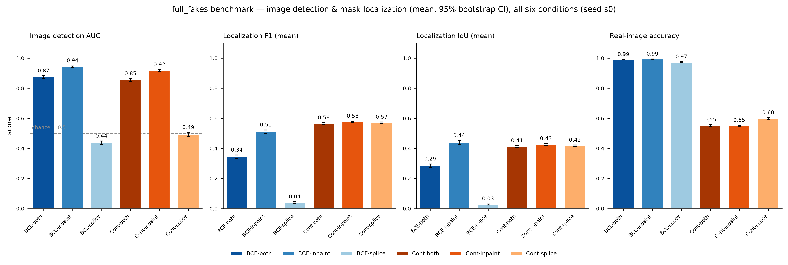
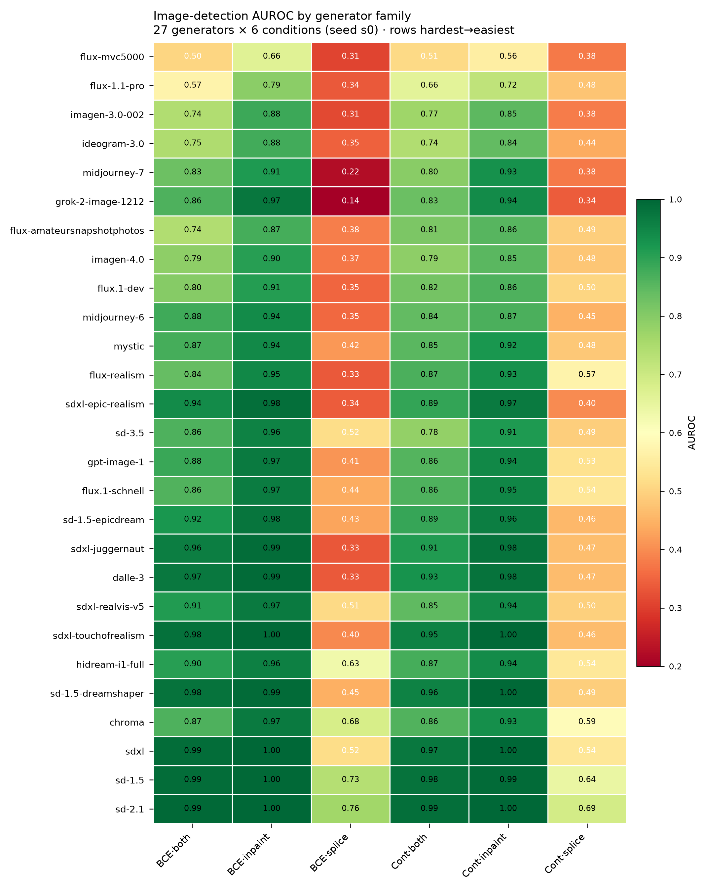
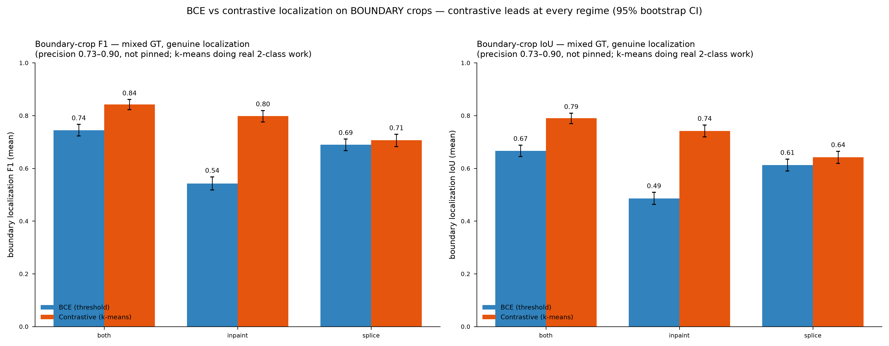
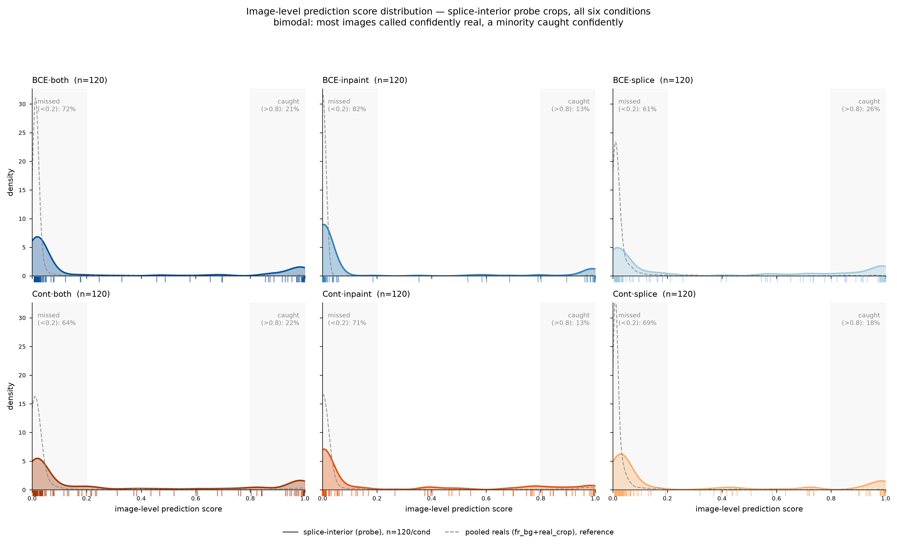

# BCE Emergence — Results Report

*DINO_SCOPE_July · `results/bce_emergence` · six conditions (BCE / contrastive objective × both / inpaint / splice training data), seed 0. All measures reported as **mean** unless a distribution is shown. Detection reported as AUROC under corrected, declared nulls with 95% bootstrap CIs (§5).*

---

## TL;DR

- **Image-level detection is the headline.** On full synthetic images, inpaint-trained models lead (AUC 0.94 BCE / 0.92 contrastive); splice-only training does **not** transfer to full fakes (0.44 / 0.49, at or below chance); "both" sits between (0.87 / 0.86).
- **On the probe benchmark, detection is AUROC — never mean image score.** The mean is not comparable across the BCE↔contrastive boundary (per-condition reals baselines differ 2–3×) and is confounded by the decoder (BCE threshold vs contrastive k-means). §5 gives the one corrected detection table.
- **Under corrected, declared nulls, every condition × type cell clears chance** (lowest CI lower-bound 0.70). Boundaries are detected near-perfectly (0.89–1.00); interiors are harder and objective-dependent (0.74–0.94).
- **The one place signal vanishes: splice interiors against the size-matched train-negative distribution.** Equalizing window size collapses BCE·splice from 0.62 to 0.53 [0.48,0.58] (CI includes chance) and Cont·splice from 0.66 to 0.59 [0.55,0.64] — the interior "signal" against the training negatives is largely size-driven, not a detectable edit (see §5.1).
- **For localization, judge boundary crops only** (interiors are all-fake → degenerate precision; full-fakes localization is a k-means byproduct). On boundaries, **contrastive leads at every regime** (§4).
- **Splice interiors are genuinely near-identical to reals** (§6): the elevated mean is a positive-outlier tail; the bulk sits a hairline above reals.

---

## 1 · Full-fakes: image detection and (byproduct) localization

Image-detection AUC, localization F1/IoU (mean), and real-image accuracy across the six conditions, with 95% bootstrap CIs.

| condition | image AUC | F1 (mean) | IoU (mean) | reals acc |
|---|---|---|---|---|
| BCE·both | 0.875 | 0.344 | 0.285 | 0.990 |
| BCE·inpaint | **0.944** | 0.510 | 0.440 | 0.992 |
| BCE·splice | 0.437 | 0.040 | 0.027 | 0.973 |
| Cont·both | 0.855 | 0.565 | 0.412 | 0.551 |
| Cont·inpaint | 0.917 | 0.576 | 0.426 | 0.549 |
| Cont·splice | 0.493 | 0.570 | 0.417 | 0.599 |

**Read:** inpaint training gives the best full-fake detector under either objective; splice-only training collapses to chance on full fakes. The BCE/contrastive gap on image AUC is small (≤0.03) at every training regime. **Localization F1/IoU on full fakes is a byproduct of spherical k-means (k=2) and is not a meaningful result** — note contrastive's flat ~0.57 F1 regardless of training data, and the reals-accuracy split (BCE ~0.99 vs contrastive ~0.55) that reflects the decoders' different "off" behaviour, not detection quality.

---

## 2 · Probe benchmark by manipulation type

Per-type localization (F1, IoU) and raw detector output (image score, predicted-positive fraction), all six conditions. **Detection AUROC is deliberately not shown here** — it lives in §5 with the corrected nulls, because the raw image score above is *not* a safe detection comparison across conditions (see §5). This panel is for localization behaviour and for seeing the decoders' false-flagging: contrastive's k-means flags ~40% of patches even on genuine real crops (no "off" state), while BCE sits near 0.00.

---

## 3 · Generator difficulty (full-fakes)

Per-generator detection AUROC, 27 generators × 6 conditions, sorted hardest→easiest. Hardest: flux-mvc5000, flux-1.1-pro, ideogram-3.0, imagen-3.0-002. Easiest: sd-2.1, sd-1.5, sdxl, sd-1.5-dreamshaper. The splice-trained columns are uniformly poor, consistent with §1.

---

## 4 · Localization: BCE vs contrastive — boundary crops only

**Interiors are the wrong stratum** for localization: they are all-fake, so contrastive precision is pinned at exactly 1.000 on 100% of crops and interior F1 reflects the k-means decoder, not representation quality. Boundary crops contain both real and fake patches — a genuine localization objective. On boundaries, **contrastive leads at every regime**:

| | BCE F1 | Cont F1 | Δ | BCE IoU | Cont IoU | Δ |
|---|---|---|---|---|---|---|
| both | 0.745 | 0.842 | +0.098 | 0.667 | 0.790 | +0.123 |
| inpaint | 0.542 | 0.798 | +0.256 | 0.485 | 0.742 | +0.257 |
| splice | 0.689 | 0.706 | +0.017 | 0.613 | 0.642 | +0.030 |

BCE·inpaint collapses on splice boundaries (sp_boundary F1 0.306) from training-data mismatch; contrastive holds up (0.712). This is the strongest single argument for the contrastive objective on the localization head.

---

## 5 · Corrected detection AUROC — the one detection table

This section replaces every earlier AUROC view. It reports detection as rank-AUROC (Mann–Whitney) under a **declared, corrected null per stratum**, with 4000× bootstrap 95% CIs.

**The corrections, and why:**

1. **AUROC, not mean image score.** Mean measures absolute activation magnitude; it is not comparable across the BCE↔contrastive boundary because each condition's reals baseline differs (contrastive reals sit 2–3× higher than BCE reals). A contrastive fake at mean 0.90 is separated from reals at ~0.07; a BCE fake at the same 0.90 clears a lower bar (~0.02). Only rank-AUROC against a matched reference is comparable across conditions.
2. **Declare the null per stratum.** Interiors are scored against the **matched `real_crop`** — the identical interior window re-derived on the pristine original with the same deterministic RNG as the paired fake (matched geometry, max |Δarea_frac| = 0 over 300 tgif pairs). Boundaries are scored against **pooled reals** (boundary AUROC is reference-independent — moves <0.06 regardless of reference). We never silently pool the `fr_bg` "real background" into an interior comparison: `fr_bg` drifts fake-ward (it is an outside-mask window on the *modified* image) and depresses interior AUROC.

**Corrected detection AUROC (point [95% CI]):**

| type | BCE·both | BCE·inpaint | BCE·splice | Cont·both | Cont·inpaint | Cont·splice |
|---|---|---|---|---|---|---|
| AI-gen boundary (n=600) | 0.99 [0.98,0.99] | 0.98 [0.98,0.99] | 0.95 [0.93,0.96] | 0.98 [0.98,0.99] | 0.98 [0.97,0.99] | 0.94 [0.93,0.95] |
| AI-gen interior (n=350) | 0.86 [0.83,0.89] | 0.94 [0.93,0.96] | 0.77 [0.73,0.80] | 0.87 [0.85,0.90] | 0.91 [0.89,0.93] | 0.74 [0.70,0.77] |
| splice boundary (n=300) | 0.98 [0.98,0.99] | 0.95 [0.93,0.96] | 1.00 [0.99,1.00] | 0.98 [0.98,0.99] | 0.89 [0.87,0.91] | 0.99 [0.99,1.00] |
| splice interior (n=120) | 0.79 [0.74,0.83] | 0.87 [0.83,0.91] | 0.85 [0.81,0.89] | 0.83 [0.79,0.87] | 0.81 [0.77,0.86] | 0.88 [0.84,0.91] |

**Every cell clears chance** — the lowest CI lower-bound across all 24 cells is 0.70. Boundaries are detected near-perfectly everywhere; interiors are harder and objective-dependent (best: BCE·inpaint ai_interior 0.94; worst: Cont·splice ai_interior 0.74).

### 5.1 · The size caveat — ai_interior vs size-corrected tgif reals

The §5 table scores interiors against the matched pristine crop. But there are three legitimate real references for `ai_interior`, and they answer different questions. Restricting to the **tgif-only subset (n=300)** so the comparison is strictly tgif↔tgif, and scoring the *same* ai_interior fakes against each:

| condition | vs matched `real_crop` (same crop, edit-only) | vs `fr_bg` raw (unmatched, ~126 px) | vs `fr_bg` size-matched (full-dist reweight) |
|---|---|---|---|
| BCE·both | 0.84 [0.80,0.87] | 0.80 | 0.80 [0.76,0.84] |
| BCE·inpaint | 0.94 [0.92,0.96] | 0.88 | 0.88 [0.85,0.91] |
| **BCE·splice** | 0.76 [0.72,0.80] | 0.62 | 0.53 [0.48,0.58] * |
| Cont·both | 0.86 [0.83,0.89] | 0.71 | 0.70 [0.66,0.74] |
| Cont·inpaint | 0.90 [0.88,0.92] | 0.76 | 0.75 [0.71,0.79] |
| **Cont·splice** | 0.72 [0.68,0.76] | 0.66 | 0.59 [0.55,0.64] |

*All AUROC point [95% CI], 4000× two-sided bootstrap. `*` = CI includes 0.5 (not distinguishable from chance). `real_crop` and size-matched `fr_bg` restricted to tgif2 parents (n=300); size-match is a full-histogram reweight of `fr_bg` onto the ai_interior window-size distribution (TV distance → 0.000), not a single-target match.*

**Why size-correct, and why it can only depress.** `fr_bg` windows are 1.31× larger than ai_interior (median 126 vs 96 px), and within `fr_bg` the image score *decreases* with window size (Spearman rho −0.06 to −0.44, negative in every condition — see Fig 10). So equalizing size removes an advantage the reals had, and the correction can only pull AUROC down, never inflate it.

**What the three columns show.** The matched `real_crop` is the strictest, most honest null (identical crop on the pristine original) and every condition clears it comfortably — the edit *is* detectable there. The size-matched `fr_bg` asks the harder train-distribution question, and it is where the two splice conditions fall apart: **BCE·splice drops 0.62 → 0.53 (CI includes chance)** and **Cont·splice 0.66 → 0.59 (marginal, p=0.0003)**, while the other four conditions barely move (raw ≈ size-matched). So the splice-interior "signal" against the training negatives was substantially size-driven; against the matched pristine crop it survives (0.76 / 0.72). This is the load-bearing caveat behind any interior claim.

---

## 6 · The splice-interior distribution

Per-image image-score distributions for splice interiors (n=120/condition), with the pooled-reals reference. **Bimodal** (verified against raw histograms, not a KDE artifact): a large low mode near reals and a small high tail. Missed (<0.2) / caught (>0.8) / middle fractions: BCE·both 72/21/7, BCE·inpaint 82/13/5, BCE·splice 61/26/13, Cont·both 64/22/13, Cont·inpaint 71/13/16, Cont·splice 69/18/12.

The elevated **mean** is carried by the high tail (heavier tampering); the **bulk of spliced interiors is near-indistinguishable from the real portions** — confirming there is no strong intrinsic "spliced-region signal." Even the low bin sits a hairline above reals (medians ~0.01–0.03 vs ~0.001–0.01, ~1.3–2.8×), enough to lift rank-AUROC without implying perceptible difference. The saliency/low-level-statistics mechanism behind that hairline shift is plausible but unconfirmed.

---

## Methodology (corrected procedures, recorded in-repo)

1. **Report the mean**, not the median, for all measures.
2. **Detection = AUROC**, not mean image score — the only quantity comparable across conditions given per-condition reals baseline drift.
3. **Declare the null.** Interiors → matched `real_crop` (same crop, edit-only). Boundaries → pooled reals (reference-independent there). Never silently pool `fr_bg` into an interior comparison.
4. **tgif↔tgif only** for size-controlled interior comparisons — ai_interior/`real_crop`/`fr_bg` restricted to tgif2 parent (n=300); the 50 sagid pairs are a different geometry.
5. **Size-match from the full distribution**, not a single target — per-bin histogram reweighting, verify TV distance → 0.
6. **CIs vs chance** — two-sided bootstrap resampling both classes; a point estimate away from 0.5 is not significance.
7. **Localization is judged on boundary crops only** — interiors are all-fake (degenerate precision) and full-fakes localization is a k-means byproduct.

**Open threads:** (a) same-decoder re-eval (contrastive+threshold AND BCE+k-means) to fully break the objective↔decoder confound — the clean test, still unrun; (b) the saliency mechanism behind the hairline interior/splice rank shift — unconfirmed; (c) `cont_both_s0` is marked `status=skipped` in `sweep_summary.csv` but has complete eval outputs — included throughout, flagged.

---

*Underlying tables: `bce_emergence_tables.xlsx`. Verified numbers and procedures also written to `CLAUDE.md` and `ANALYSIS_NOTES_bce_emergence.md` in the repo.*
